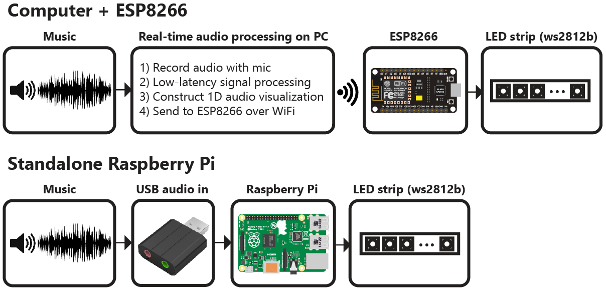
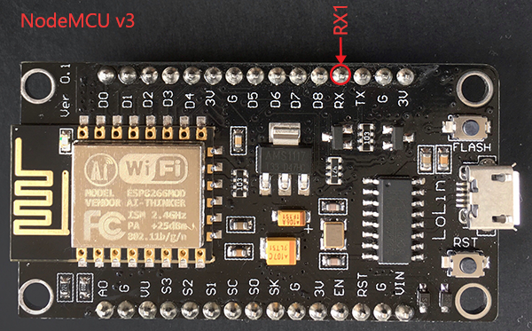
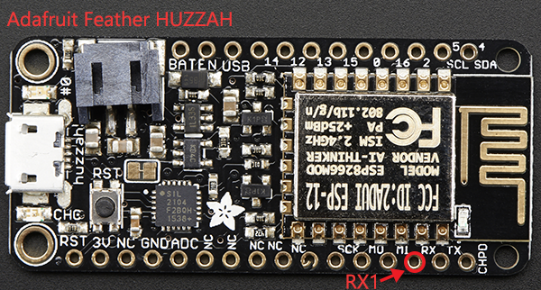

# Audio-react
Real-time LED strip music visualization using Python and the ESP8266 or Raspberry Pi
 
 

# Demo

# Filter Bank
It is a filter bank with triangular shaped bands
arnged on the mel frequency scale.

# What Do You Need? 
* Computer + ESP8266 
To build a visualizer using a computer and ESP8266, you will need:
* Computer with Python 2.7 or 3.5 (Anaconda is recommended on Windows)
* SP8266 module with RX1 pin exposed. These modules can be purchased for as little as $5 USD. These modules are known to be compatible, but many others will work too:
* NodeMCU v3
* Adafruit HUZZAH
* Adafruit Feather HUZZAH
* WS2812B LED strip (such as Adafruit Neopixels). These can be purchased for as little as $5-15 USD per meter.
* 5V power supply
* 3.3V-5V level shifter (optional, must be non-inverting)
Limitations when using a computer + ESP8266:
* The communication protocol between the computer and ESP8266 currently supports a maximum of 256 LEDs.

# Standalone Raspberry Pi
You can also build a standalone visualizer using a Raspberry Pi. For this you will need:
* Raspberry Pi (1, 2, or 3)
* USB audio input device. This could be a USB microphone or a sound card. You just need to find some way of giving the Raspberry 
* Pi audio input.
* W2812B LED strip (such as Adafruit Neopixels)
* 5V power supply
* .3V-5V level shifter (optional)
Limitations when using the Raspberry Pi:
* Raspberry Pi is just fast enough the run the visualization, but it is too slow to run the GUI window as well. It is recommended that you disable the GUI when running the code on the Raspberry Pi.
* The ESP8266 uses a technique called temporal dithering to improve the color depth of the LED strip. Unfortunately the Raspberry Pi lacks this capability.

# Installation for Computer + ESP8266
# Python Dependencies
Visualization code is compatible with Python 2.7 or 3.5. A few Python dependencies must also be installed:
* Numpy
* Scipy (for digital signal processing)
* PyQtGraph (for GUI visualization)
* PyAudio (for recording audio with microphone)

On Windows machines, the use of Anaconda is highly recommended. Anaconda simplifies the installation of Python dependencies, which is sometimes difficult on Windows.

# Istalling dependencies with Anaconda
Create a conda virtual environment (this step is optional but recommended)

`onda create --name visualization-env python=3.5
activate visualization-env`
Install dependencies using pip and the conda package manager
`onda install numpy scipy pyqtgraph
pip install pyaudio`
# Istalling dependencies without Anaconda
The pip package manager can also be used to install the python dependencies.

`pip install numpy
pip install scipy
pip install pyqtgraph
pip install pyaudio `
If pip is not found try using `python -m pip install` instead.

# Arduino dependencies
ESP8266 firmare is uploaded using the Arduino IDE. Setup the Arduino IDE for ESP8266.
After installing the Arduino IDE and ESP8266 addon, use the Arduino Library Manager to install the "WebSocketServer" library.

# Hardware Connections
# ESP8266
The ESP8266 has hardware support for I²S and this peripheral is used to control the ws2812b LED strip. This signficantly improves performance compared to bit-banging the IO pin. Unfortunately, this means that the LED strip must be connected to the RX1 pin, which is not accessible in some ESP8266 modules (such as the ESP-01).

The RX1 pin on the ESP8266 module should be connected to the data input pin of the ws2812b LED strip (often labelled DIN or D0).

For the NodeMCU v3 and Adafruit Feather HUZZAH, the location of the RX1 pin is shown in the images below. Many other modules also expose the RX1 pin.
 
 

# Raspberry Pi
Since the Raspberry Pi is a 3.3V device, the best practice is to use a logic level converter to shift the 3.3V logic to 5V logic (WS2812 LEDs use 5V logic). There is a good overview on the best practices here.

Although a logic level converter is the best practice, sometimes it will still work if you simply connect the LED strip directly to the Raspberry Pi.

You cannot power the LED strip using the Raspberry Pi GPIO pins, you need to have an external 5V power supply.

The connections are:
* Connect GND on the power supply to GND on the LED strip and GND on the Raspberry Pi (they MUST share a common GND connection)
* Connect +5V on the power supply to +5V on the LED strip
* Connect a PWM GPIO pin on the Raspberry Pi to the data pin on the LED strip. If using the Raspberry Pi 2 or 3, then try Pin 18.

# Setup and Configuration
Install Python and Python dependencies
Install Arduino IDE and ESP8266 addon
Download and extract all of the files in this repository onto your computer
Connect the RX1 pin of your ESP8266 module to the data input pin of the ws2812b LED strip. Ensure that your LED strip is properly connected to a 5V power supply and that the ESP8266 and LED strip share a common electrical ground connection.
In ws2812_controller.ino:
* set 
`const char* ssid `
to your router's SSID
Set 
`const char* password `
to your router's password
Set `IPAddress gateway`
to match your router's gateway
Set `
IPAddress ip `
to the IP address that you would like your ESP8266 to use (your choice)
Set `
#define NUM_LEDS 
`
to the number of LEDs in your LED strip
Upload the ws2812_controller.ino firmware to the ESP8266. Ensure that you have selected the correct ESP8266 board from the boards menu. In the dropdown menu, set CPU Frequency to 160 MHz for optimal performance.
In config.py:
Set 
`
N_PIXELS 
`
to the number of LEDs in your LED strip (must match NUM_LEDS in ws2812_controller.ino)
Set 
`
UDP_IP 
`
to the IP address of your ESP8266 (must match ip in ws2812_controller.ino)
If needed, set 
`
MIC_RATE`
to your microphone sampling rate in Hz. Most of the time you will not need to change this.

# If you encounter any problems with the code please open a new issue.

# Install ws281x library
To install the ws281x library I recommend following this Adafruit tutorial.
`
sudo apt-get install build-essential python-dev git scons swig
git clone https://github.com/jgarff/rpi_ws281x.git
cd rpi_ws281x
scons
cd python
sudo python setup.py install
`
